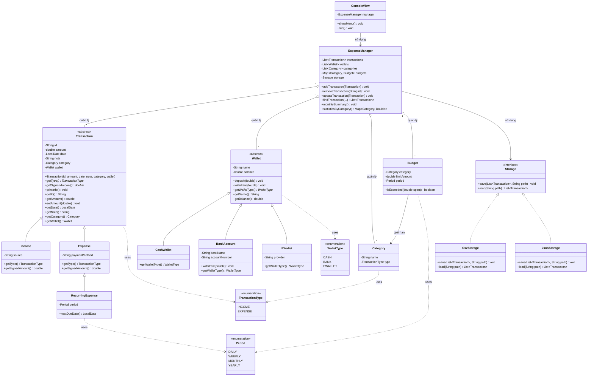

# Sơ đồ lớp (Class Diagram) — Personal Expense Manager

> File này dùng cú pháp Mermaid. Nếu đặt trong repo GitHub (đuôi `.md`), GitHub sẽ tự
> động render thành sơ đồ khi xem file trên web — không cần cài thêm công cụ nào.
> Có thể để nguyên file này trong repo, hoặc copy khối code bên dưới vào README.md.



## Chú thích ký hiệu quan hệ

- `<|--` : kế thừa (extends)
- `<|..` : cài đặt interface (implements)
- `o--` : composition/aggregation (ExpenseManager "sở hữu" danh sách các đối tượng)
- `-->` : phụ thuộc/tham chiếu bình thường (association/dependency)
- `..>` : dependency nhẹ (chỉ dùng tới, ví dụ dùng enum)
- `*` sau tên phương thức trong lớp abstract/interface: phương thức trừu tượng

## Cách dùng cho bài nộp

1. Commit file `class-diagram.md` này vào thư mục gốc hoặc `docs/` của repo.
2. Xem trực tiếp trên GitHub (web) — Mermaid sẽ tự render thành hình.
3. Nếu cần ảnh tĩnh (PNG/SVG) để dán vào báo cáo Word/PDF, mở file này trên
   [Mermaid Live Editor](https://mermaid.live), dán nội dung trong khối ```mermaid```,
   rồi export ra PNG/SVG.
