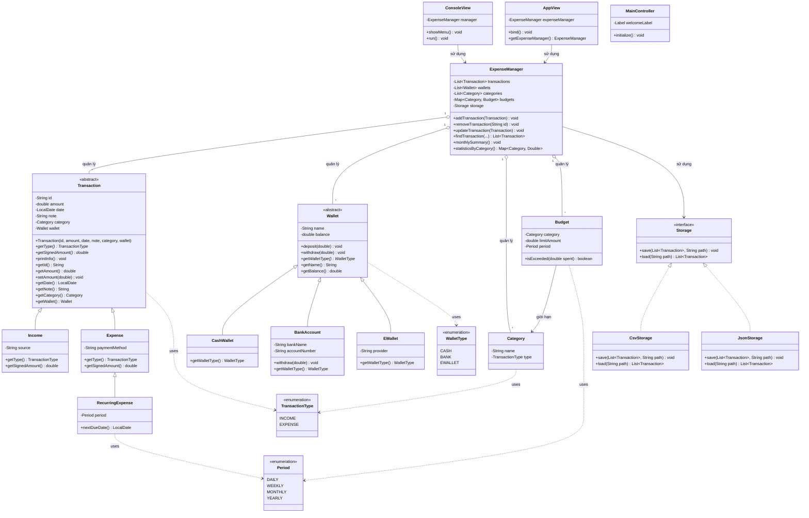

# Sơ đồ lớp (UML) — Personal Expense Manager

Tài liệu mô tả quan hệ OOP theo đặc tả thiết kế.

> File này dùng cú pháp Mermaid. Khi xem trên GitHub, sơ đồ sẽ tự động được render —
> không cần cài thêm công cụ nào.

## Kế thừa (Inheritance)

```text
Transaction (abstract)
├── Income
└── Expense
    └── RecurringExpense

Wallet (abstract)
├── CashWallet
├── BankAccount
└── EWallet
```

## Interface

```text
«interface» Storage
├── CsvStorage
└── JsonStorage
```

## Enum

| Enum | Giá trị |
|------|---------|
| `TransactionType` | `INCOME`, `EXPENSE` |
| `WalletType` | `CASH`, `BANK`, `EWALLET` |
| `Period` | `DAILY`, `WEEKLY`, `MONTHLY`, `YEARLY` |

## Composition / Coordination

```text
ExpenseManager
  *-- Transaction
  *-- Wallet
  *-- Category
  *-- Budget          (Map<Category, Budget>)
  o-- Storage

Category  <--  Budget
Category  <--  Transaction
Wallet    <--  Transaction

ConsoleView / AppView  -->  ExpenseManager
MainController (JavaFX) -->  (FXML + AppView / ExpenseManager)
```

## Nguyên tắc OOP

| Nguyên tắc | Áp dụng |
|------------|---------|
| Đóng gói | Field `private`; getter/setter + validate (`amount`, `balance`) |
| Kế thừa | `Income`/`Expense` ← `Transaction`; các ví ← `Wallet` |
| Đa hình | `getSignedAmount()`, `printInfo()`, `withdraw()`, `Storage.save/load` |
| Trừu tượng | `Transaction`, `Wallet` (abstract); `Storage` (interface) |

## Sơ đồ Mermaid



## Chú thích ký hiệu quan hệ

- `<|--` : kế thừa (extends)
- `<|..` : cài đặt interface (implements)
- `o--` : composition/aggregation (ExpenseManager "sở hữu" danh sách các đối tượng)
- `-->` : phụ thuộc/tham chiếu bình thường (association/dependency)
- `..>` : dependency nhẹ (chỉ dùng tới, ví dụ dùng enum)
- `*` sau tên phương thức trong lớp abstract/interface: phương thức trừu tượng

## Cách dùng cho bài nộp

1. Commit file `class-diagram.md` này trong thư mục `docs/` của repo.
2. Xem trực tiếp trên GitHub (web) — Mermaid sẽ tự render thành hình.
3. Nếu cần ảnh tĩnh (PNG/SVG) để dán vào báo cáo Word/PDF, mở
   [Mermaid Live Editor](https://mermaid.live), dán nội dung khối `mermaid` ở trên,
   rồi export ra PNG/SVG. Bản PNG sẵn có: `docs/class-diagram.png`.
